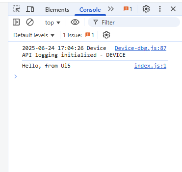

## Index html dosyası ana verilerimin tutulduğu dosyadır 

`index.html` dosyası, projenin ana giriş noktasıdır ve temel yapıyı, gerekli script ve stil dosyalarına referansları içerir.

## index.js dosyası oluşturuldu

`index.js` dosyası projeye eklenmiştir. Bu dosya, uygulamanın ana JavaScript işlevselliğini yönetmek için kullanılacaktır.
## data-sap-ui-onInit Açıklaması

`data-sap-ui-onInit="module:ui5/product/list/index"` ifadesi, `index.html` dosyasındaki `<script>` etiketi içinde kullanılır. Bu özellik, SAPUI5 uygulaması başlatılırken belirtilen modülün (`ui5/product/list/index`) yüklenmesini ve çalıştırılmasını sağlar. Böylece uygulamanın başlangıcında gerekli JavaScript kodları otomatik olarak devreye girer.

## Body Etiketine Eklenen Sınıf

`<body class="sapUiBody">` şeklinde, `body` etiketine `sapUiBody` sınıfı eklenmiştir. Bu sınıf, SAPUI5 uygulamalarında temel stil ve düzenlemelerin uygulanmasını sağlar.

## index.js Dosyasına Eklenen Kod

`console.log("Hello, from Ui5");` satırı, `index.js` dosyasına eklenmiştir. Bu kod, uygulama başlatıldığında tarayıcı konsolunda "Hello, from Ui5" mesajının görüntülenmesini sağlar.

