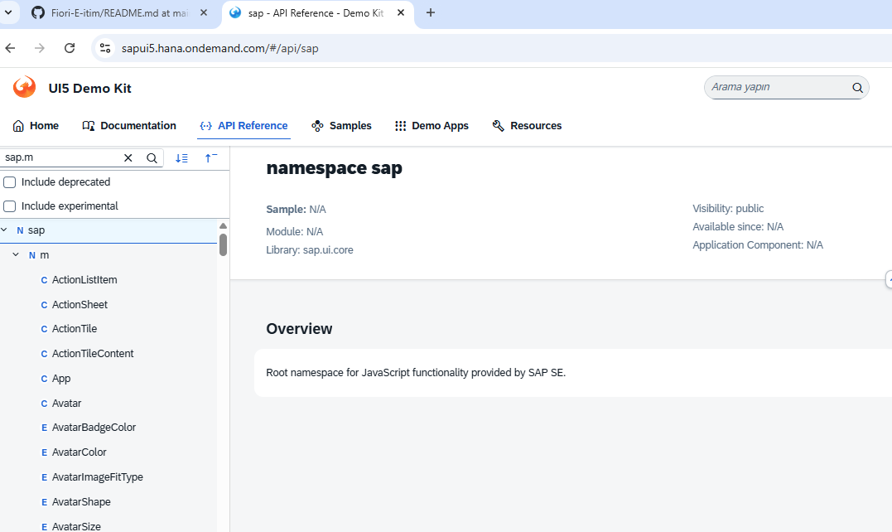
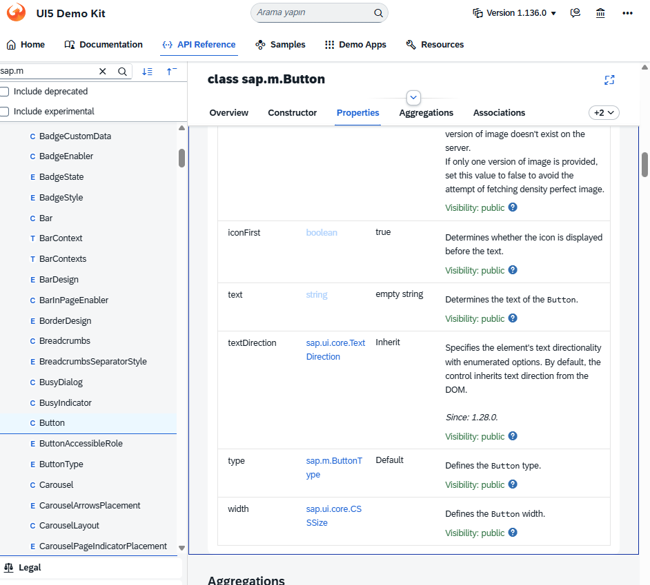
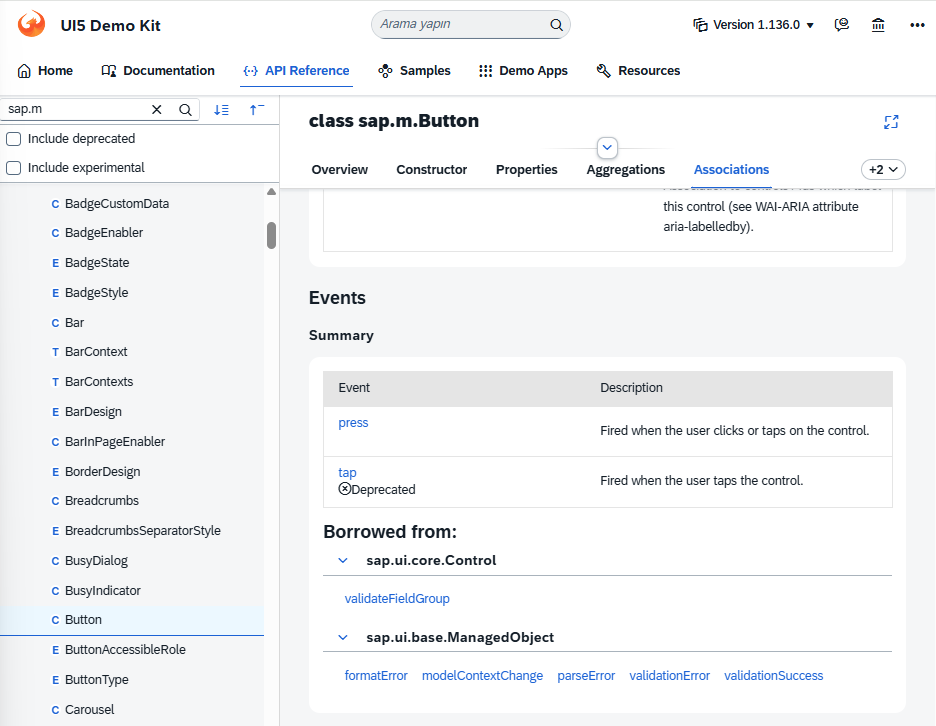
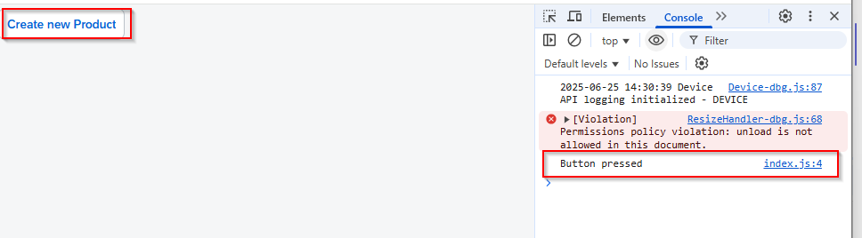

SAPUI5 API'ları, SAP'nin modern web uygulamaları geliştirmek için sunduğu kapsamlı bir JavaScript kütüphanesidir. https://sapui5.hana.ondemand.com/#/api adresinde, SAPUI5'in sunduğu tüm sınıflar, arayüzler, modüller ve fonksiyonlar detaylı şekilde dokümante edilmiştir. Bu API dokümantasyonu sayesinde geliştiriciler, SAPUI5 ile uygulama geliştirirken ihtiyaç duydukları tüm teknik bilgilere ve örneklere kolayca ulaşabilirler.
Aşağıdaki görselde, bir buton eklemek için kullanılan arayüzü görebilirsiniz:



Butona bir event (örneğin, `press` olayı) eklemek için ise aşağıdaki ekran kullanılır:

Yukarıdaki kod ile bir buton oluşturulmuş ve `press` olayına bir fonksiyon atanmıştır. Bu fonksiyon, butona tıklandığında konsola "Button pressed" mesajını yazacaktır.


```javascript
new sap.m.Button('idMyButton', {
    text: "Create new Product",
    press: () => {
        console.log("Button pressed");
    }
}).placeAt("content");
```


## Butona tıklandıktan sonra 



Butona tıklandıktan sonra görünen resim ve açıklama.

