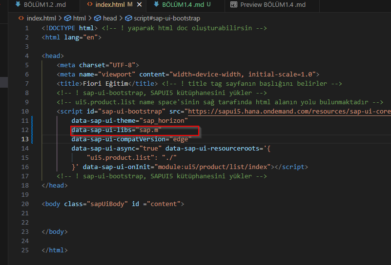

Aşağıda belirtmiş olduğum button u class'a alacağım bu classa aldıktan sonra performans daha artmış olacak
``` javascript
new sap.m.Button('idMyButton', {
    text: "Create new Product",
    press: () => {
        console.log("Button pressed");
    }
}).placeAt("content") 
```

öncelikle sap.ui.define i oluşturuyoruz

```javascript
    sap.ui.define([], function() {
    "use strict";
    
});
```

oluşturduğumuz define ın içerisine buttonumuzun api yolunu veriyoruz 
bunun button olmasına da gerek yok herhangibir js kütüphanesinin bir alanını aldığımız zaman bunu bu şekilde kullanabiliriz
```javascript
sap.ui.define(['sap/m/Button'], function(Button) {
    "use strict";
    
});
```

buttonun içeriğini artık fonksiyon ile çağırabiliriz ve index.html de buttonumu

```javascript
sap.ui.define(['sap/m/Button'], function(Button) {
    "use strict";
    new Button( {
    text: "Create new Product",
    press: () => {
        console.log("Button pressed");
    }
}).placeAt("content");
});
```
Artık `index.html` dosyamızda daha önce eklediğimiz `data-sap-ui-libs='sap.m'` kütüphanesine gerek kalmadı, bu satırı silebiliriz.


